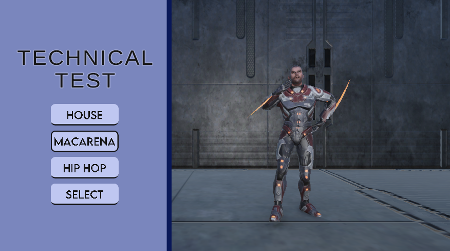
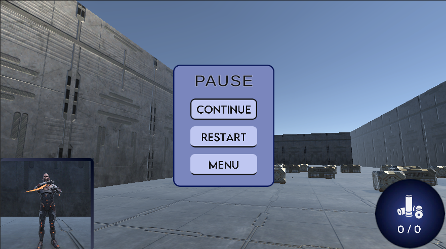
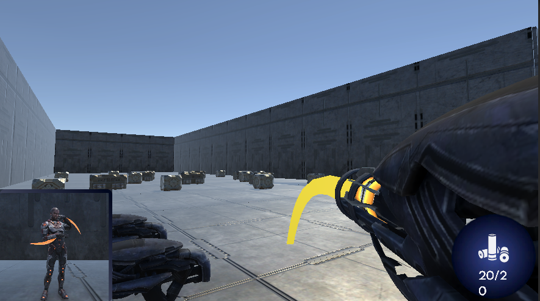
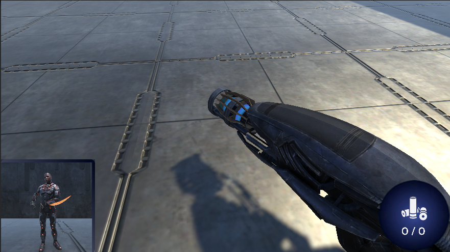

# Prueba Técnica: Life is the Game

**Autor:** Juan Sebastián Rincón Villamil  
**Correo de la prueba técnica:**  

> Buenas días Sebastián Barragán,  
>  
> Espero te encuentres bien, te envío la información para el desarrollo de la prueba Unity.  
>  
> **Descripción:**  
>  
> Se desarrollará un juego básico en Unity3D haciendo uso del material adjunto, el juego se dividirá en dos instancias principales.  
>  
> Al iniciar, se desplegará una interfaz en canvas que nos mostrará el modelo, esta incluirá 4 botones. Tres de ellos, al ser clickeados, cambiarán la animación del personaje por la asignada a cada botón, mientras que el último determinará la animación a seleccionar. Al terminar este proceso, se enviará al usuario a una segunda escena.  
>  
> En esta segunda fase, la vista será en primera persona. Se podrá ver al personaje reproduciendo la animación asignada en una pequeña esquina del UI.  
>  
> Por otro lado, el usuario podrá escoger entre 3 armas distintas en el suelo, cada una con disparo diferente:  
> 
> - La primera realiza un disparo con trayectoria parabólica.  
> - La segunda genera un campo alrededor que atrae objetos cercanos, haciéndolos orbitar alrededor del proyectil.  
> - La tercera será libre pero deberá incluir alguna propiedad física similar a las anteriores.  
>  
> Todas las armas tendrán valores personalizables mediante un **Scriptable Object**, que será cargado al iniciar el juego.  
>  
> **Entrega de la prueba:** Por favor enviar el repositorio Git de la prueba con libre acceso (preferible) o enviar las carpetas del proyecto. Versión Unity 6.  
>  
> **Fecha límite de entrega:** Domingo 01 de Febrero. Si logras enviarla antes, genial!!!

---

## Índice

1. [Solución Sección 1: Selección de la Animación](#seccion-1-seleccion-de-la-animacion)  
   - [Cómo se interactúa](#como-se-interactua)  
   - [Solución](#solucion)  

2. [Solución Sección 2: Elección de Arma y Realización de estas](#seccion-2-eleccion-de-arma-y-realizacion-de-estas)  
   - [Inputs del player (teclado y mando)](#inputs-del-player-teclado-y-mando)  
   - [Explicación de las armas](#explicacion-de-las-armas)  
   - [Solución](#solucion-1)  

3. [Conclusión y Agradecimientos](#conclusion-y-agradecimientos)  

---

## Sección 1: Selección de la Animación

### Cómo se interactúa
El usuario puede moverse utilizando las teclas del teclado o los botones del control, gracias al **nuevo Input System**. Se descartó el uso del mouse para la selección de animaciones por comodidad y simplicidad en la interacción.  

### Solución
- Se utilizó un **GameManager** junto con un **LevelManager** para gestionar el cambio de escenas.  
- Para las animaciones se implementó un **Blend Tree**, lo que permite evitar la creación de muchos estados de animación y simplemente variar un parámetro numérico, haciéndolo mucho más cómodo y eficiente.  
- Para seleccionar la animación, se combinó el **patrón Observer** con un método asignable a los botones, que permite escoger la animación correspondiente.  
- Para guardar la información entre escenas se utilizaron **clases estáticas**, lo que permite mantener los datos del NPC (o mejor dicho, del personaje) durante todo el juego.  

---

## Sección 2: Elección de Arma y Realización de estas

### Inputs del player (teclado y mando)

- **Teclado:**  
  - **Movimiento:** Se utiliza `WASD`, también se puede usar las flechas.  
  - **Rotación de cámara:** Opcionalmente mouse.  
  - **Agarrar objeto:** Tecla `B`.  
  - **Soltar objeto:** Tecla `G`.  
  - **Disparar:** Tecla `F`.  

- **Mando:**  
  - **Movimiento:** Joystick izquierdo (también se pueden usar ambos sticks).  
  - **Agarrar objeto:** Botón cuadrado.  
  - **Soltar objeto:** Botón triángulo.  
  - **Disparar:** Botón círculo.  

### Explicación de las armas

1. **Arma 1:** Disparo parabólico. Lanza una esfera que rebota utilizando físicas mediante **Rigidbody**. Además, se implementaron dos efectos visuales: un **Line Renderer** que indica la trayectoria del proyectil y partículas que emergen del arma al disparar.  

2. **Arma 2:** Disparo que atrae objetos cercanos. Se lanza un orbe que absorbe los objetos que entren en su alcance y los hace orbitar junto al proyectil. Como efectos visuales se aplicó un **shader** a la esfera para simular el campo de atracción, partículas tipo **Glow** y partículas adicionales que salen del arma.  

3. **Arma 3:** Libre, con propiedades físicas personalizables. Se diseñó para absorber objetos, compactarlos durante el recorrido y expulsarlos al final. Se añadieron efectos visuales similares a los del Arma 2 para mantener coherencia estética.

### Solución

- Me permitió aprender a manejar las interfaces sin necesidad de usar el mouse.  
- Mejoré la aplicación de los **principios SOLID**, implementando interfaces para la creación y gestión de las armas mencionadas anteriormente.  
- Aprendí a manejar **Scriptable Objects**, los cuales no había utilizado con frecuencia antes.  
- Practiqué escribir código claro y entendible para otros desarrolladores, comentando la función de cada método, algo que en mis proyectos anteriores no era necesario.  
- Perfeccioné el uso del patrón **Singleton**, aplicándolo únicamente en clases que realmente lo requerían.  

---

## Conclusión y Agradecimientos

En este proyecto demostré que puedo realizar las tareas encomendadas dentro del tiempo establecido, prestando atención a los detalles para entregar un trabajo pulido.  

La razón por la que en el nivel donde se encuentran las armas no hay un objetivo de derrota o victoria es porque prioricé mostrar correctamente las armas, que eran el foco principal de la Sección 2. Evité añadir elementos que pudieran consumir demasiado tiempo, como construir un nivel completo, para centrarme en lo más importante de la prueba.  

Las herramientas utilizadas fueron:  
- **Unity3D:** Principal herramienta para el desarrollo de la prueba.  
- **Figma:** Para el diseño de la UI.  
- **Blender:** Para ajustar detalles de los modelos y las armas.  
- **ChatGPT:** Apoyo en programación y solución de dudas, aunque todas las decisiones de implementación fueron mías.  

Agradezco la oportunidad de realizar esta prueba técnica y espero que el proyecto cumpla con las expectativas.

---

